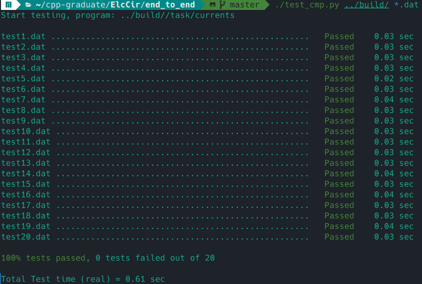
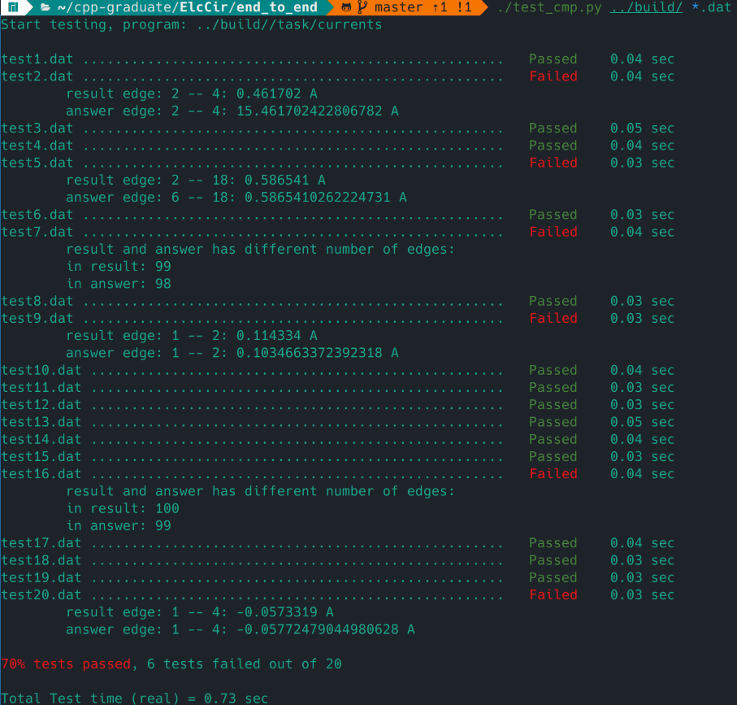

# Test Runner library

Library to run end to end tests.
# `run_test()`

run_test(exe, test_names, test_cmp)

Arguments:

    exe - executable file of program 

    test_names - names of files with tests

    test_cmp - function that compare answer from exe and prepared answer

        get file with result of exe and file with prepared answer

        return tuple with int (0 if test failed, 1 if paseed) and output message for error

# Example of working

Example from [project](https://github.com/LegendaryHog/ElcCir.git):

Example of successful tests:

Example of failed tests:

